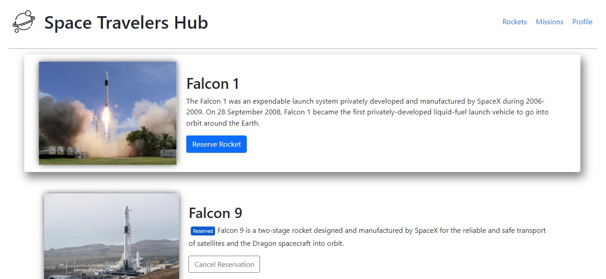
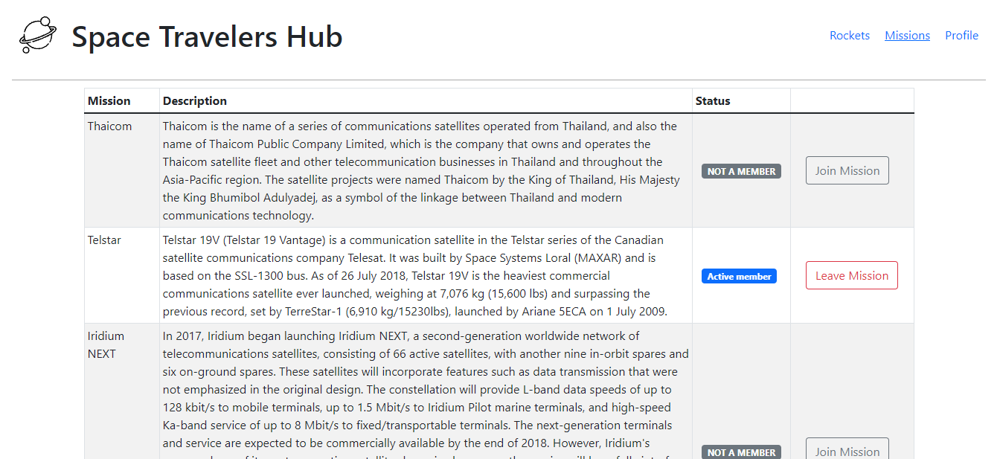
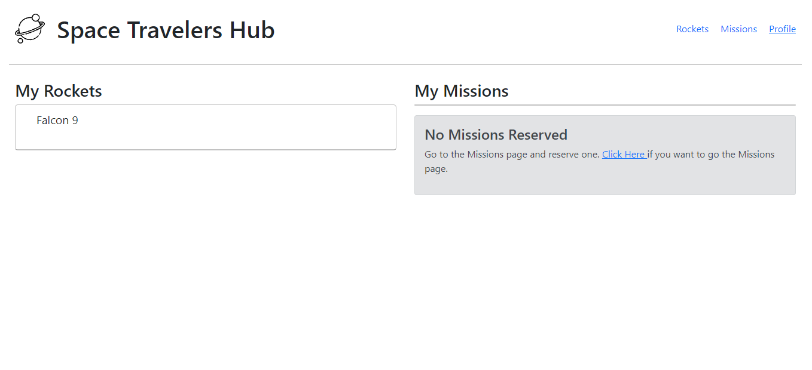

  
  
  
  
  

        

 
 

  <em align="center" style>“Everyday life is like programming, I guess. If you love something you can put beauty into it.”</em><strong> - Lao Tzu</strong>
  

# Space Traveler's Hub

- The Space Travelers is a website web application for a company that provides commercial and scientific space travel services. The application will allow users to book rockets and join selected space missions.

## Built With

- JSX, JavaScript with ES6
- React.js with redux
- Linters, Node.js, Git, Flexbox, React-Bootstrap

## Live demo

[Live Demo Link](https://petudeveloper.github.io/space-travelers/)

## Available Scripts

In the project directory, you can run:

### `npm start`

Runs the app in the development mode.\
Open [http://localhost:3000/space-travelers/](http://localhost:3000/space-travelers/) to view it in the browser.

The page will reload if you make edits.\
You will also see any lint errors in the console.

### `npm test`

Launches the test runner in the interactive watch mode.\
See the section about [running tests](https://facebook.github.io/create-react-app/docs/running-tests) for more information.

### `npm run build`

Builds the app for production to the `build` folder.\
It correctly bundles React in production mode and optimizes the build for the best performance.

The build is minified and the filenames include the hashes.\
Your app is ready to be deployed!

# Authors

👤 **David Alvarez**

- GitHub: [@David Alvarez](https://github.com/petudeveloper)
- Twitter: [@David](https://twitter.com/petudeveloper)
- LinkedIn: [LinkedIn](https://www.linkedin.com/in/davidalvarezmazzo/)

👤 **Leonardo de Andrade**

- GitHub: [Leo de Andrade](https://github.com/leonardoeng13)
- LinkedIn : [Leonardo de Andrade](https://www.linkedin.com/in/leonardodeandrade/)
- Twitter: [Leo de Andrade](https://twitter.com/andrede_leo)

# 🤝 Contributing

Contributions, issues, and feature requests are welcome!

Feel free to check the [issues page](https://github.com/petudeveloper/space-travelers/issues).

# Show your support

Give a ⭐️ if you like this project!

## Acknowledgments

- Hat tip to anyone whose code was used
- Inspiration
- etc

## 📝 License

This project is [MIT](./MIT.md) licensed.
